# AYO RECIPES 

[Back to main README file](README.md)

[View the delopyed site](http://ayo-recipes.herokuapp.com/)

## TESTING
 

**Table of Contents** 
1. [Validator Testing](#validator-testing)  
   - [HTML](#html)   
   - [CSS](#css)
2. [User Stories Testing](#user-stories-testing)  
   - [Unregistered User Goals](#unregistered-user-goals)   
   - [Registered User Goals](#registered-user-goals)  
   - [Admin User Goals](#admin-user-goals)  
3. [Further Testing]()    
2. [Manual Testing](#manual-testing)   
   - [HOMEPAGE AS A GUEST](#home-page-as-a-guest-user)   
   - [RECIPES PAGE](#recipes)   
   - [Responsiveness]()   
   - [Links]()  
   - [Forms]()   
   - [Defensive Testing]()  
  
5. [JSHint Testing]()    
6. [Pep8 Online Testing]()
7. [Lighthouse Testing]()  
   
 

## **VALIDATOR TESTING**
#### **HTML**
* [W3C Markup Validation](https://validator.w3.org/): This is also used to check the validity of the html code for all webpages created. Our code was found to have some errors due to the jinja template. 

#### **HTML**
* [W3C CSS validation](https://jigsaw.w3.org/css-validator/): This is used to validate the CSS code used on all webpages created. Our code is found to be error-free by the validator.

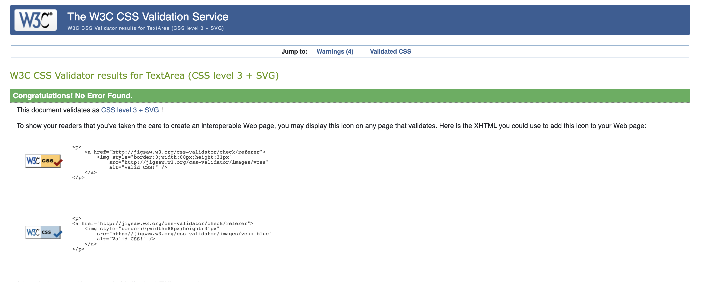

## **USER STORIES**
### **Unregistered User Goals**   
As a new/ unregistered user, I want to:
1. Easily understand the purpose of the site and how it works.

When a user arrives at the home page, the header image welcomes them to the site, capturing their attention and keeping them interested in the site. The user can easily scroll down to see a summary of Ayo Recipes, what it entails, and what to expect when visiting the site.  
   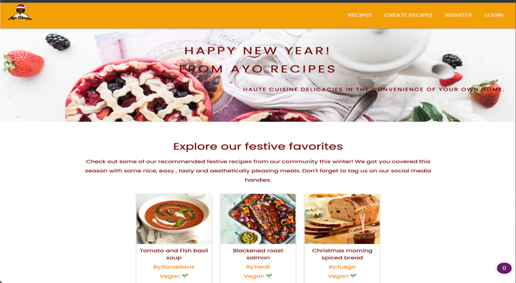

There is a fully responsive navigation bar that the user can hover over. A white box shadow appears over the menu line items when the user hovers over the menu.
    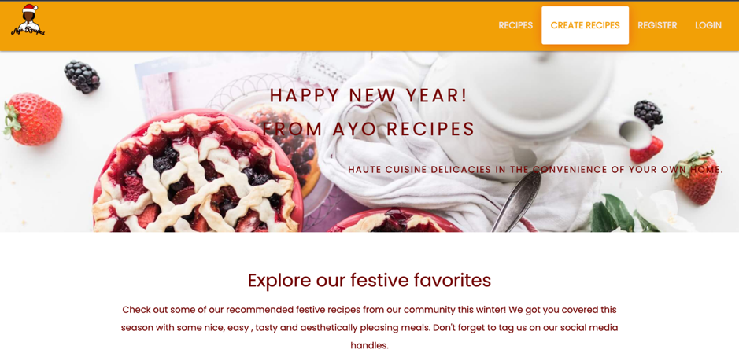

The website has been designed to be extremely user-friendly. When a user clicks on one of the links, he or she is taken to the desired page. When a user performs any of the basic CRUD functions, such as registering with Ayo Recipes, a flash message appears informing them of their action.
    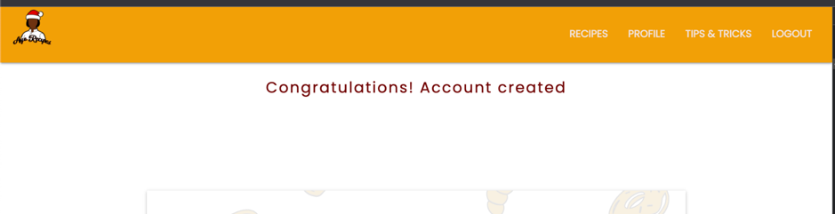

2. View all the recipes available with directions on how to prepare and cook the recipe.

When the user hovers over and clicks the recipe menu option. The user is directed to the recipes page, which displays all of the Ayo database's recipes.

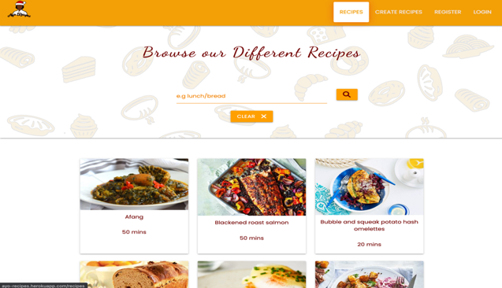

The user can view more information about the recipes individually by clicking on any of the recipe cards. When the user clicks, he or she is taken to a single recipe page that displays all of the information about a specific recipe (cooking ingredients and directions).

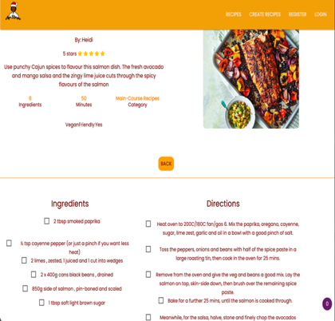

When a user clicks the "Back button" in the middle of the page, they are directed to the Login page, where they can log into their profile, create a new recipe, and order any of the recipes created by other registered users.

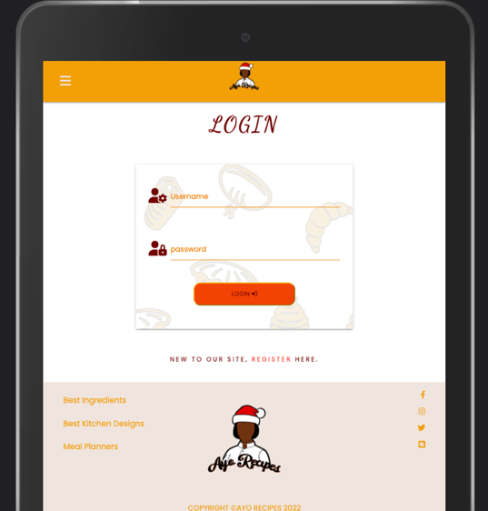
    

3. Easily search for recipes and be able to view the full details of the recipe interested in.

The user is presented with a search bar on the recipes Page, which is located in the middle of the header image. The search bar contains the search icon, which allows the user to query their search, and the clear button, which allows the user to cancel the search. 
The user can search for recipe or category names, which will return results if the recipe/category name is found.

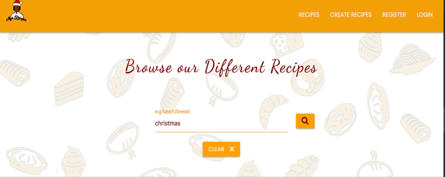

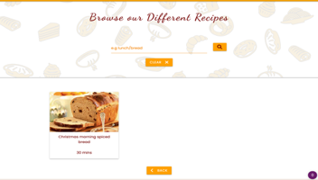

The user can reset the search query by clicking the "CLEAR" button, or they can return to the home page by clicking the "BACK" button at the bottom of the page.

4. Easily locate the call to action buttons on the site to allow the user either register or Sign up 

When a user visits the homepage, the register and Login buttons appear on the navigation bar and, when clicked, direct the user to either the register or Login page. 

The "Create Menu" option in the navbar also takes the user to the login page, because in order to create a new recipe, the user must first register with Ayo Recipes.

### **Registered User Goals** 
As a returning/ registered user, I want to:
1.	Easily Log  into my profile dashboard to explore recipes made by me.

When a user arrives at the home page, he or she can either register to create a profile or log in by clicking on any of the menu options shown in the image above. When a user logs in, they are taken to their profile, where they are greeted, as shown below. When the user is a guest, the menu bar looks different.

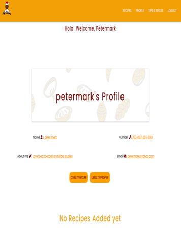

If the user hasn't created any recipes yet, the text "No recipes added Yet" will appear under the user's personal information, as shown in the image above. If the user clicks the "Create Recipe" button, they will be taken to the add recipe page, where they can add a new recipe. Once this has been added, the user can view the recipes that have been added by them on their profile in the form of a card. See the list below.

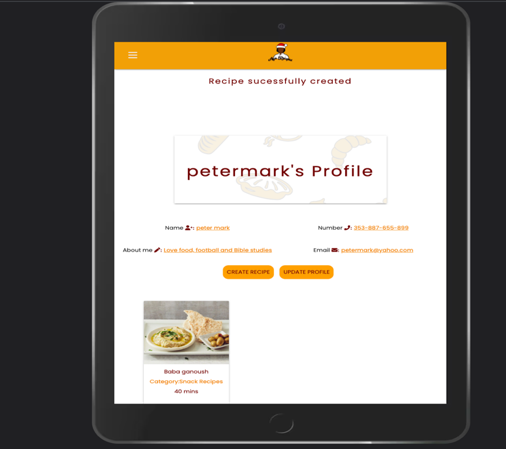

2.	Easily search for recipes either by recipe name or the recipe category.

When a user is logged in, they can view all of the recipes at Ayo Recipes by going to the homepage or the recipes page. 
If the user wants to search for recipes by category names, they can easily do so by clicking on the images or category names on the index.html page.

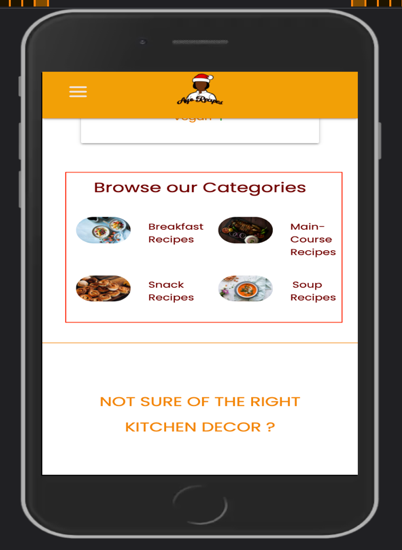

This takes the user to the "view category.html" page, where they can see all of the recipes in that category.

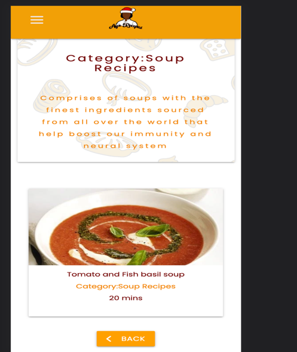

The user can also view all of the recipes on the website by selecting the "recipes" menu option. The present search bar can be used to query the user's searches. The user can conduct a search using either the recipe name or the category name. The user is notified if no results are found. See the following:

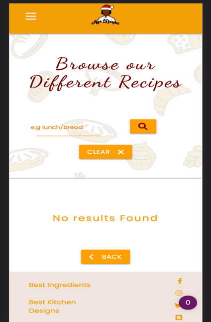

3. Be able to create my own recipe and share on the site. Edit it’s content and delete if the case need be. 

When the user logs into their profile, two buttons appear under their personal information. These two buttons allow the user to "Create Recipe" or "Update Profile." When a user clicks the "Create Recipe" button, they are taken to the add recipe page, where they can add a new recipe. If the user clicks the submit button, the recipe is saved to their profile; if the user clicks the "Cancel" button, they are returned to their profile page. 

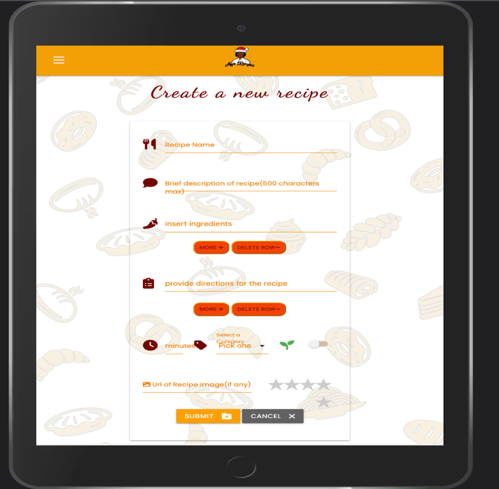

Once the recipe is added, the user's profile will be updated with all of their recipes, as shown in the images above.

To learn more about the recipe, the user can click on the recipe card, which takes them to the single-recipe.html page.

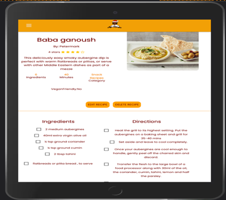

When the user views the recipe they created, they will notice the "EDIT" and "DELETE" recipe buttons, allowing them to perform either function. When a user clicks the "EDIT" button, they are taken to the "edit-recipe.html" page, which displays a form field with prepopulated data containing the recipe details. When finished, the user can update the fields of their choice by clicking the "Update Recipe" button. If they want to cancel the update, they can do so by clicking the "CANCEL" button and then being diverted back to the single -recipe page.

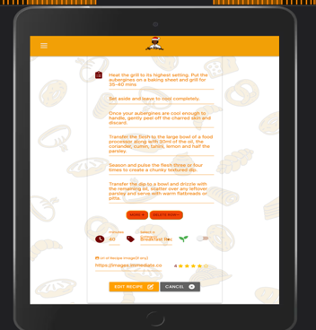

If the user changes the fields and then clicks the "Update Recipe" button, a flash message appears and the user is redirected back to their profile page, with a feedback at the top.

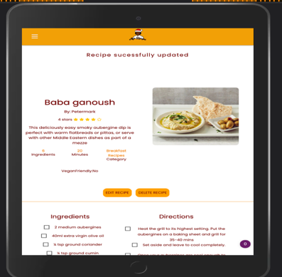

If a user wants to delete a recipe, they can do so by clicking the "DELETE" button on the single-recipe page. When the button is clicked, a modal appears asking the user to confirm their action.

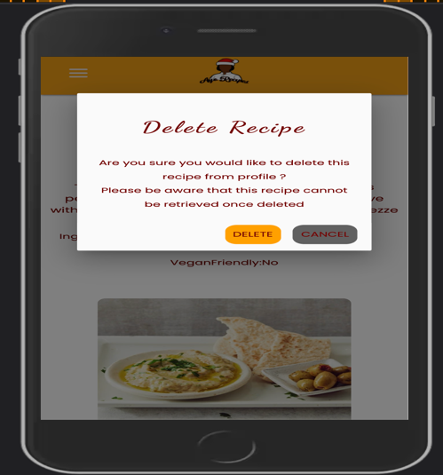

The user can confirm their decision to delete the recipe by clicking the "DELETE" button, or they can return to the single recipe page by clicking "CANCEL." If the delete button is pressed, the recipe is deleted, and the user is notified that their action was successful.

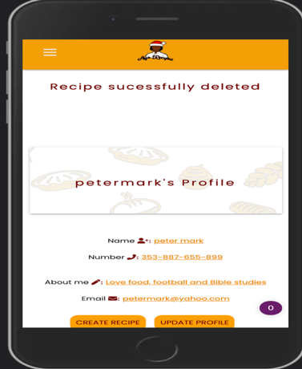

4. Easily edit my personal profile in case changes are needed.

The user can update their personal information in their profile by clicking on the "UPDATE PROFILE" button, which takes them to the edit-profile page. The edit-profile page contains the user's prepopulated data, allowing the user to easily make changes to any fields.

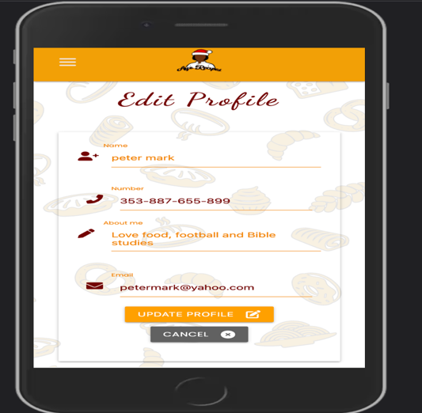

After updating the fields, the user can either click "UPDATE PROFILE" or "CANCEL." If the user clicks the "UPDATE PROFILE" button, they will receive confirmation that their action was successful.

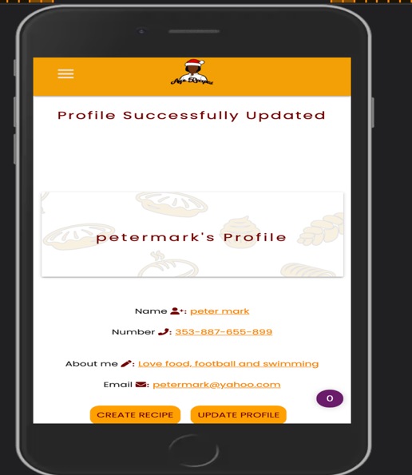

If the user does not want to update their profile information, they can click the "CANCEL" button and be taken back to their profile page, which displays all of the recipes they have created.

5. Be able to order recipes online

If the user is registered or has an account with Ayo Recipes, they can order recipes online. After logging into their profile and visiting the home page, the user can see the "ORDER NOW" button by clicking on any of the recipes created by other users. This takes the user to a third-party site where they can order the recipe takeaway directly. 

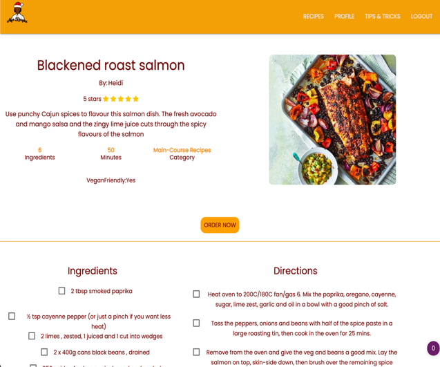

If the user is viewing a page that they created, the buttons that appear on the single-recipe page are different, with the "edit" and "delete" buttons present due to some defensive back end programming.

### **Admin User Goals**
As an Admin User, I want to:

1.	Be able to do all the functionalities assigned to a registered user.

When an administrator logs into Ayo recipes, they see the same menu navigation bar as a registered user. The admin user has access to all recipes and can search for them. Like a registered user, the admin user can create a recipe and edit their profile.

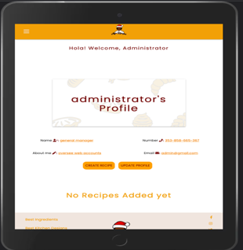

The buttons that appear for a user who created a recipe appear on the single -recipe page when the admin user wants to view each recipe card to see more information about each recipe. All recipes created by users can be edited and deleted by the admin user. The recipe below, for example, was created by a user named "Heidi," and the admin user has access to all functions as Heidi.

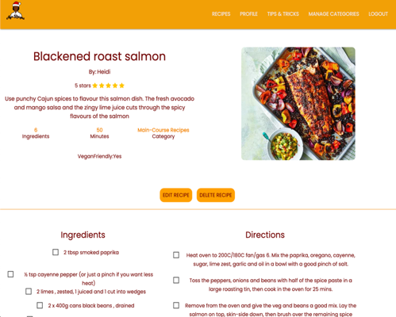

2. Restrict access for certain features that can only be accessed by the admin. 

When the admin user logs in to Ayo Recipes, they can see all of the menu items that the registered user can see, but there is an additional menu item "MANAGE CATEGORIES" that is only available to the admin user. 

The admin user also has access to all recipes created by users, allowing the admin user to edit or delete each recipe's information.

3. Add, Edit, or Delete the category of recipes present.

When an administrator logs into Ayo Recipes, the menu item "MANAGE CATEGORIES" allows the administrator to add a new category, edit existing categories, and delete any unwanted categories.

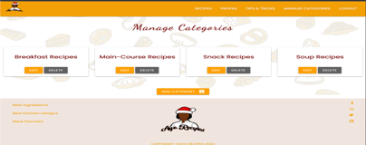

When the admin clicks the "ADD CATEGORY" button, the user is taken to the add-category page, where the admin can enter the category name and description.
 
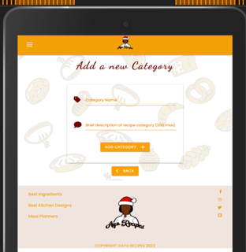

The category would be added to the manage-category page if the user clicked the "ADD CATEGORY" button.

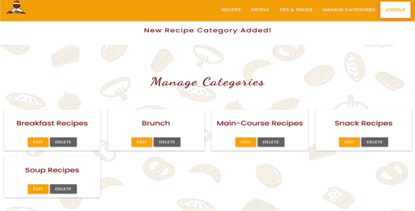

If the admin user wants to delete the newly added category, they must click the "DELETE" button, which will open a modal asking the admin user to confirm their action. 

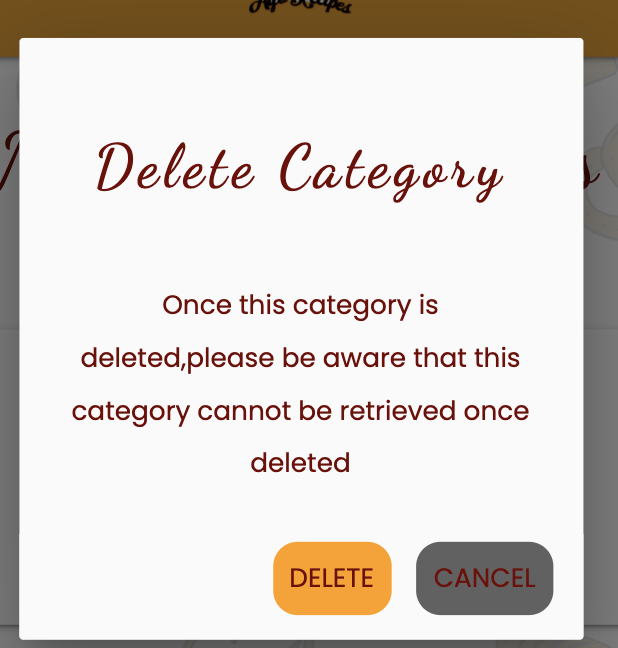

The new category would be removed once the admin user confirms their action and clicks the delete button.

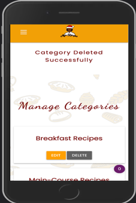

4. Be able to edit , delete and update any recipes listed on the site.

When an admin user logs into their profile, they can see the same buttons that a registered user sees, which are "create recipe" and "edit profile." 
The admin user has the ability to create new recipes as well as edit existing recipes on the website that were created by other users. The admin user has the ability to delete all of the recipes created by different users.

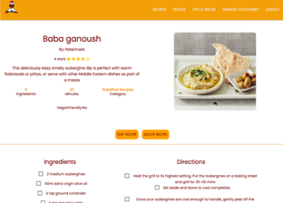

## **MANUAL TESTING**
### Testing All Features On Each Page

#### HOMEPAGE AS A GUEST USER 

 1. Navigation bar 

     1. Go to the Index page(Home) on a desktop . 

     2. Change the desktop's screen size to that of a tablet device to ensure that the navigation bar is responsive and changes to a hamburger dropdown symbol when the medium break point is reached. The navigation bar should be positioned correctly, with the menu items in place.

         There was no overflow of the navbar or undesirable modifications to the menu items when testing the responsiveness of the navbar. The navigation bar changed to a hamburger dropdown symbol with the dropdown menu items in place, as intended.

    3. Hover over the alert dismissive message button and make sure it does not create any undesirable changes to the navigation bar when exited.

          When tested on all devices, the alert dismissive button closes without impeding the navigation bar. The navigation bar is still present, as expected.

    4. Hover your mouse over the navbar menu items and click on each link to ensure that it takes you to the relevant page.

         When tested on all devices , the menu links function as intended. Linking to the appropriate sites.

    5. Click on the FLYBODY logo to ensure that it takes you to the home page when you click on it. 

         Testing this on all devices by adjusting the screen width it can be seen the brand logo “FLYBODY” links to the home page whenever clicked.

    6. Change the screen size to that of a tablet or mobile device and check that the hamburger icon appears. Also, make sure that the dropdown menu links from the hamburger icon have a background overlay when hovered over and that they all lead to the relevant pages.

         When the screen width of the navigation bar is changed to that of a tablet device, the navigation bar responds as expected, and the hamburger icon appears. When you click the hamburger icon, a dropdown menu emerges, displaying the menu links, which have a light grey background overlay when hovered and link to the proper pages when clicked. When the hamburger icon was pressed, the dropdown menu links were properly aligned. The menu items, however, have been centred to improve the appearance of the navigation bar on a tablet and mobile device.

    7. Hover over the menu items on a desktop to ensure that a light grey background overlay appears when hovered.

         When the effect was tested on a desktop device by hovering the mouse over the menu item in the navigation bar, the light grey backdrop appeared.

2.