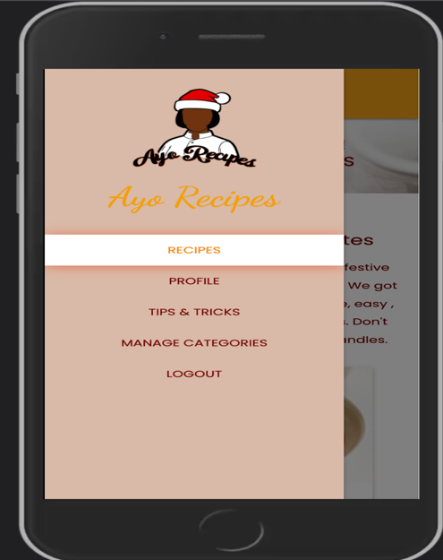
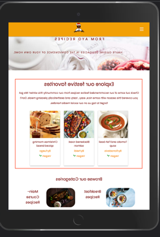
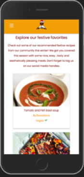
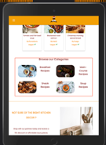
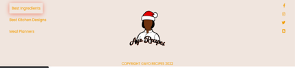

# AYO RECIPES 

[Back to main README file](README.md)

[View the delopyed site](http://ayo-recipes.herokuapp.com/)

## TESTING
 

**Table of Contents** 
1. [Validator Testing](#validator-testing)  
   - [HTML](#html)   
   - [CSS](#css)
2. [User Stories Testing](#user-stories-testing)  
   - [Unregistered User Goals](#unregistered-user-goals)   
   - [Registered User Goals](#registered-user-goals)  
   - [Admin User Goals](#admin-user-goals)  
3. [Further Testing]()    
2. [Manual Testing](#manual-testing)   
   - [HOMEPAGE AS A GUEST](#homepage-as-a-guest-user)   
   - [RECIPES PAGE](#recipes)   
   - [Responsiveness]()   
   - [Links]()  
   - [Forms]()   
   - [Defensive Testing]()  
  
5. [JSHint Testing]()    
6. [Pep8 Online Testing]()
7. [Lighthouse Testing]()  
   
 

### **VALIDATOR TESTING**
#### **HTML**
* [W3C Markup Validation](https://validator.w3.org/): This is also used to check the validity of the html code for all webpages created. Our code was found to have some errors due to the jinja template. 

#### **HTML**
* [W3C CSS validation](https://jigsaw.w3.org/css-validator/): This is used to validate the CSS code used on all webpages created. Our code is found to be error-free by the validator.

### **USER STORIES**
#### **Unregistered User Goals**   
As a new/ unregistered user, I want to:
1. Easily understand the purpose of the site and how it works.

When a user arrives at the home page, the header image welcomes them to the site, capturing their attention and keeping them interested in the site. The user can easily scroll down to see a summary of Ayo Recipes, what it entails, and what to expect when visiting the site.  
   

There is a fully responsive navigation bar that the user can hover over. A white box shadow appears over the menu line items when the user hovers over the menu.
    

The website has been designed to be extremely user-friendly. When a user clicks on one of the links, he or she is taken to the desired page. When a user performs any of the basic CRUD functions, such as registering with Ayo Recipes, a flash message appears informing them of their action.
    

2. View all the recipes available with directions on how to prepare and cook the recipe.

When the user hovers over and clicks the recipe menu option. The user is directed to the recipes page, which displays all of the Ayo database's recipes.

The user can view more information about the recipes individually by clicking on any of the recipe cards. When the user clicks, he or she is taken to a single recipe page that displays all of the information about a specific recipe (cooking ingredients and directions).

When a user clicks the "Back button" in the middle of the page, they are directed to the Login page, where they can log into their profile, create a new recipe, and order any of the recipes created by other registered users.

    

3. Easily search for recipes and be able to view the full details of the recipe interested in.

The user is presented with a search bar on the recipes Page, which is located in the middle of the header image. The search bar contains the search icon, which allows the user to query their search, and the clear button, which allows the user to cancel the search. 
The user can search for recipe or category names, which will return results if the recipe/category name is found.

The user can reset the search query by clicking the "CLEAR" button, or they can return to the home page by clicking the "BACK" button at the bottom of the page.

4. Easily locate the call to action buttons on the site to allow the user either register or Sign up 

When a user visits the homepage, the register and Login buttons appear on the navigation bar and, when clicked, direct the user to either the register or Login page. 

The "Create Menu" option in the navbar also takes the user to the login page, because in order to create a new recipe, the user must first register with Ayo Recipes.

### **Registered User Goals** 
As a returning/ registered user, I want to:
1.	Easily Log  into my profile dashboard to explore recipes made by me.

When a user arrives at the home page, he or she can either register to create a profile or log in by clicking on any of the menu options shown in the image above. When a user logs in, they are taken to their profile, where they are greeted, as shown below. When the user is a guest, the menu bar looks different.

If the user hasn't created any recipes yet, the text "No recipes added Yet" will appear under the user's personal information, as shown in the image above. If the user clicks the "Create Recipe" button, they will be taken to the add recipe page, where they can add a new recipe. Once this has been added, the user can view the recipes that have been added by them on their profile in the form of a card. See the list below.

2.	Easily search for recipes either by recipe name or the recipe category.

When a user is logged in, they can view all of the recipes at Ayo Recipes by going to the homepage or the recipes page. 
If the user wants to search for recipes by category names, they can easily do so by clicking on the images or category names on the index.html page.

This takes the user to the "view category.html" page, where they can see all of the recipes in that category.

The user can also view all of the recipes on the website by selecting the "recipes" menu option. The present search bar can be used to query the user's searches. The user can conduct a search using either the recipe name or the category name. The user is notified if no results are found. See the following:

3. Be able to create my own recipe and share on the site. Edit it’s content and delete if the case need be. 

When the user logs into their profile, two buttons appear under their personal information. These two buttons allow the user to "Create Recipe" or "Update Profile." When a user clicks the "Create Recipe" button, they are taken to the add recipe page, where they can add a new recipe. If the user clicks the submit button, the recipe is saved to their profile; if the user clicks the "Cancel" button, they are returned to their profile page. 

Once the recipe is added, the user's profile will be updated with all of their recipes, as shown in the images above.

To learn more about the recipe, the user can click on the recipe card, which takes them to the single-recipe.html page.

When the user views the recipe they created, they will notice the "EDIT" and "DELETE" recipe buttons, allowing them to perform either function. When a user clicks the "EDIT" button, they are taken to the "edit-recipe.html" page, which displays a form field with prepopulated data containing the recipe details. When finished, the user can update the fields of their choice by clicking the "Update Recipe" button. If they want to cancel the update, they can do so by clicking the "CANCEL" button and then being diverted back to the single -recipe page.

If the user changes the fields and then clicks the "Update Recipe" button, a flash message appears and the user is redirected back to their profile page, with a feedback at the top.

If a user wants to delete a recipe, they can do so by clicking the "DELETE" button on the single-recipe page. When the button is clicked, a modal appears asking the user to confirm their action.

The user can confirm their decision to delete the recipe by clicking the "DELETE" button, or they can return to the single recipe page by clicking "CANCEL." If the delete button is pressed, the recipe is deleted, and the user is notified that their action was successful.

4. Easily edit my personal profile in case changes are needed.

The user can update their personal information in their profile by clicking on the "UPDATE PROFILE" button, which takes them to the edit-profile page. The edit-profile page contains the user's prepopulated data, allowing the user to easily make changes to any fields.

After updating the fields, the user can either click "UPDATE PROFILE" or "CANCEL." If the user clicks the "UPDATE PROFILE" button, they will receive confirmation that their action was successful.

If the user does not want to update their profile information, they can click the "CANCEL" button and be taken back to their profile page, which displays all of the recipes they have created.

5. Be able to order recipes online

If the user is registered or has an account with Ayo Recipes, they can order recipes online. After logging into their profile and visiting the home page, the user can see the "ORDER NOW" button by clicking on any of the recipes created by other users. This takes the user to a third-party site where they can order the recipe takeaway directly. 

If the user is viewing a page that they created, the buttons that appear on the single-recipe page are different, with the "edit" and "delete" buttons present due to some defensive back end programming.

### **Admin User Goals**
As an Admin User, I want to:

1.	Be able to do all the functionalities assigned to a registered user.

When an administrator logs into Ayo recipes, they see the same menu navigation bar as a registered user. The admin user has access to all recipes and can search for them. Like a registered user, the admin user can create a recipe and edit their profile.

The buttons that appear for a user who created a recipe appear on the single -recipe page when the admin user wants to view each recipe card to see more information about each recipe. All recipes created by users can be edited and deleted by the admin user. The recipe below, for example, was created by a user named "Heidi," and the admin user has access to all functions as Heidi.

2. Restrict access for certain features that can only be accessed by the admin. 

When the admin user logs in to Ayo Recipes, they can see all of the menu items that the registered user can see, but there is an additional menu item "MANAGE CATEGORIES" that is only available to the admin user. 

The admin user also has access to all recipes created by users, allowing the admin user to edit or delete each recipe's information.

3. Add, Edit, or Delete the category of recipes present.

When an administrator logs into Ayo Recipes, the menu item "MANAGE CATEGORIES" allows the administrator to add a new category, edit existing categories, and delete any unwanted categories.

When the admin clicks the "ADD CATEGORY" button, the user is taken to the add-category page, where the admin can enter the category name and description.
 

The category would be added to the manage-category page if the user clicked the "ADD CATEGORY" button.

If the admin user wants to delete the newly added category, they must click the "DELETE" button, which will open a modal asking the admin user to confirm their action. 

The new category would be removed once the admin user confirms their action and clicks the delete button.

4. Be able to edit , delete and update any recipes listed on the site.

When an admin user logs into their profile, they can see the same buttons that a registered user sees, which are "create recipe" and "edit profile." 
The admin user has the ability to create new recipes as well as edit existing recipes on the website that were created by other users. The admin user has the ability to delete all of the recipes created by different users.

### **MANUAL TESTING**

#### TESTING ALL FEATURES ON EACH PAGE 

#### **HOMEPAGE AS A GUEST USER** 

 1. Navigation bar 

     1. Navigate to the Index page (Home) on a desktop by clicking the Ayo Recipes brand logo in the upper left corner. 

     2. Change the desktop's screen size to that of a tablet device to ensure that the navigation bar is responsive and changes to a hamburger icon as the screen width decreases to that of a tablet or mobile device. The navigation bar should be fixed, and menu items should be hidden in the side navigation bar that appears on medium to small devices.

         When testing responsiveness across different devices, there was no overflow of the navbar. On a tablet and a mobile device, the navigation bar menu changed to a hamburger icon, and the menu items were displayed in the side navigation as expected. The menu items are in place, and the navigation bar is fixed, with the brand logo image in the centre.

    3. Hover your mouse over the navbar menu items and click on each link to ensure that you are taken to the correct page.

          When tested on all devices, the menu links work as expected. The user is directed to the appropriate sites, which are recipes, login and the registration page for a guest user.

    4. Hover over the menu items to ensure that a white background overlay appears with a box shadow on the white background when the mouse is hovered.

         When testing the effect on a desktop device by hovering the mouse over the menu item in the navigation bar, the white backdrop appears with a box shadow when the mouse is hovered over the menu item.

    5. When you click on the Ayo Recipes logo, make sure it takes you to the home page. 

         When tested on all devices by adjusting the screen width, the brand logo for Ayo Recipes actually takes the user to the home page when clicked.

    6. On a tablet or mobile device, ensure that the Ayo Recipes Brand Logo is centred on the navigation bar.

         When the device's screen width is reduced to that of a tablet or mobile device, the Ayo Recipes Brand Logo is centred on the navigation bar, as expected.

    7. Change the screen size to that of a tablet or mobile device and verify that the side navigation appears when the user clicks the hamburger icon. The menu items should be displayed in the side navigation. Additionally, ensure that the menu links from the hamburger icon have a background overlay when hovered over and that they all lead to the appropriate pages.

         When the width of the navigation bar is changed to that of a tablet device, the hamburger icon appears as expected. When you click the hamburger icon, a side navigation bar menu appears, displaying the menu links. When hovered, the menu links have a white background overlay and link to the appropriate pages when clicked. The menu items have been centred to improve the appearance of the navigation bar on a tablet and mobile device. When the image brand logo is also clicked, the user is taken to the homepage. 

         

2. Hero image  

    1.	Navigate to the Index page (Home) on a desktop by clicking the Ayo Recipes brand logo in the upper left corner. 

    2. Check that the hero image is visible and occupies the entire width of the screen on all devices.

         On a desktop, the hero image fills the entire screen width with no overflow issues. When the screen size is changed to a tablet or mobile device, the same effect occurs; the hero image takes up the entire screen width.

    3. Confirm that when the home page (index page) loads on all devices, the hero image text header has an animation effect and that the tagline text is hidden on all small devices such as mobile.

         The hero image text header has a stretch animation effect when tested on a desktop device. The same thing happens on a tablet and a mobile device. However, certain text in the hero image, such as the tagline text, is hidden on a mobile device to keep the mobile screen clean and visually appealing.

         

3. Explore Festive section    

    1. Navigate to the Home page, which is the Index page on a desktop.
     
    2. Confirm that the brief summary of Ayo Recipes and the three recipe cards below the summary adjust responsively as the screen width changes .From a medium breakpoint point upwards, the recipe cards should occupy three columns per row, whereas on a smaller device, such as a mobile, the recipe cards should only occupy one column per row. 

         When tested on a desktop device, the festive container adjusts to fit the width of the screen. On a tablet device, the recipe cards appear as expected.
         
         
         
         When viewing the recipe cards on a mobile device, they appear on top of each other, one card per row, as expected. The font size and images adjust as needed, and are responsive on all devices.

         

    3. Confirm that the recipe card container design includes a picture, a title, and some engaging text. When the screen width is changed, the recipe cards should change to fit the size of the screen, with the fonts also changing to fit the size of the screen. On a mobile device, each container should take up the entire width of the screen, yielding one recipe card per row.

        When tested on a desktop device, the recipe card container contains an image, title, and engaging text that is responsive to the screen as it is changed in the dev tools. The font size is also screen-responsive. The same effect occurs on a tablet device, where the recipe cards adjust responsively to the screen width, fitting well on the screen. When viewed on a mobile device, the three recipe cards appear on top of each other, occupying the entire screen width, creating a clean and visually appealing appearance.

    4. Hover your mouse over the image of the recipe cards and confirm if the alt text appears.

         When the mouse is hovered over the images, the alt text appears as expected.

    5.	Confirm that the recipe cards displayed on the index page in the “Explore festive section ” are sorted by recipes with high ratings.. 
    
        Clicking on each of the recipe cards demonstrates that the recipes displayed in the festive container have high ratings. The recipes with the highest ratings appear first.

4. Browse our Categories Section 
   
    1. Navigate to the Home page, which is the Index page on a desktop.

    2. Confirm that the categories have been divided into four distinct image pills, each with its own heading text. The image pills should adjust to the screen size so that they look good on all devices. 

         When tested on a desktop device, the categories occupy two rows, with one row containing two images and two heading text of the category names. When the screen width is changed to a tablet device, the image pills retain their structure, but the images and font size adjust to fit the size of the screen, making it visually appealing to the user.

         

         

    3. Hover your mouse over the image pills in the category to see the alt text.

         When tested, the alt text is visible when the mouse is hovered over the image.

    4. Confirm that when the category image pill is clicked or the header text beside the image pill  is clicked the user is directed to the correct page. 

         Confirm that the user is directed to the correct page when the category image pill or the header text beside the image pill is clicked.

          
    
5. Kitchen Décor 

    1. Go to the Home page (the Index page on a desktop) and scroll down to the page. 
       
    2. Ensure that the image is responsive on all devices and that the font size adjusts to fit the width of the screen.

        When tested on a desktop device, the image is responsive. As the screen width is reduced, the image, as well as the font used on the text, shrinks. On a mobile device, the text appears above the image to fit the size of the screen and appear clean and organized and less clustered.

            

    3. Confirm that the button under the kitchen décor text enlarges when hovered over and directs the user to the correct page when clicked.

        When this is tested, it can be seen that when the button is hovered over, a light box shadow appears on the button. When the button is pressed, a new page appears, which directs the user to the third-party site as expected.

        

6. Footer 

    1. Navigate to the Home page, also known as the Index page on a desktop, and scroll down to the footer.

    2. Adjust the screen width of the device to see if the footer content is responsive. Check that the image in the desktop footer is hidden on a mobile device.

         When tested on a desktop device, the footer content is displayed in three columns, with the text in each column visible as expected. The second column contains the brand image logo, which, when clicked, takes the user to the website's homepage. As the width of the screen changes, the footer content adjusts to fit. The text and icons have been shrunk in size. However, on a mobile device, the second column with the brand logo is hidden, making the footer appear cleaner and less crowded.

    3. Hover your mouse over the social media icons in the third column of the footer section to see if they have a background overlay. 

        When testing this on all devices and hovering over the social network icons, each icon has a background overlay with a box shadow when hovered. This informs the user of which icon is currently selected. The outcome is as expected.

        

    4.	Ensure that clicking on the social media icons takes you to the correct page.

         When tested by clicking on the social media links in the footer, it is clear that all of the social media icons, as expected, lead to Ayo Recipes social accounts.

    5.	Confirm that the links in the first column of the footer take the user to the correct page and that when hovered over, a box shadow appears. 

         Hovering the mouse over the links on a desktop or tablet device reveals that the box shadow appears as expected. When the user clicks on any of the links, he or she is taken to the homepage, as expected.  

         

 
    6. Confirm that the brand logo in the footer has an  alt text when hovered and links to the home page when clicked.

         When tested on a desktop device, the alt text appears when the mouse is hovered over the image, and when the user clicks the brand image, they are directed to the homepage as expected.

